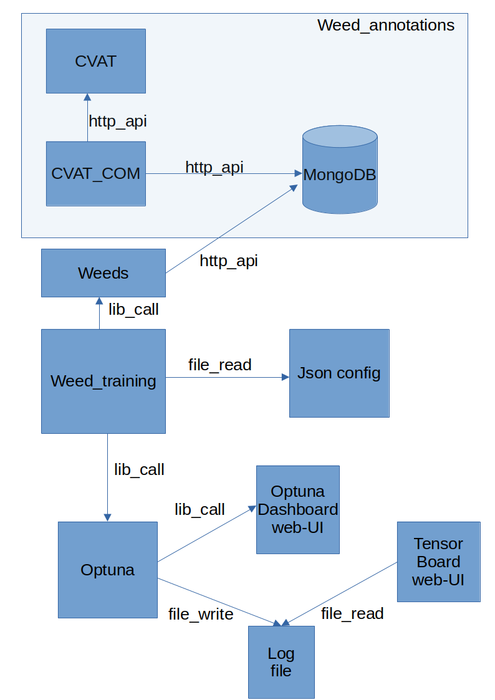

# Training repo for the OBDB project

For an overview of the Openweeds project and some background on this documentation see [obdb_docs](https://github.com/edl78/obdb_docs).

## Architecture
- The code depends on having a mongodb instance with all annotation data collected from CVAT, meaning weed_annotations must first be started (unless going for *fast-track to training*, see [obdb_docs](https://github.com/edl78/obdb_docs).
- Bayesian optimization performed via Sherpa for hyperparameters.
- Can output a number of networks ['resnet18', 'resnet34', 'resnet50', 'resnet101', 'resnet152'] or any combination of pytorch available networks. As a default the code is configured to train a resnet18 for the weed detection task.
- If fast track method is chosen, see [obdb_docs](https://github.com/edl78/obdb_docs), weed_training is stand alone and depends only on the image data and pickle files.





## How to run
- Fill usernames and passwords in the env files .env and env.list, .env is used by docker-compose and env.list is sent as environment variables into the container.
### Needed to be run once at the start
- Shell scripts for building docker image: `sh build_training.sh`
- To download the images run full_hd (recommended and supported): `docker-compose -f docker-compose-download-full-hd.yml up` or for 4k versions: `docker-compose -f docker-compose-download-4k.yml up`
- To download the artefacts (annotations, pre-trained model and other necessary files) run: `docker-compose -f docker-compose-download-artefacts.yml up`
- There is an optional WASP contributed segmentation dataset, it can be uploaded to cvat via `docker-compose -f docker-compose-upload-wasp-segmentation-data-cvat.yml up` and assumes the data folder with images named wasp is located in the fielddata folder.

### Training
All training depend on pickle files. These can be created (see Auto-annotations section below) or found in the `artefacts` folder. To use the downloaded pickle files, they must be moved from the artefacts folder to the train folder according the set path variables above. The path to the pickle files to be used should be set in the variables `TRAINING_PICKLE_PATH` and `VALIDATION_PICKLE_PATH` in the `.env` file. Important to note that these paths are not host paths but rather paths as seen from the inside of the container using them. Thus any pickle file must be found somewhere under the `train` folder as mounted by the docker-compose file. 

To start training, the main docker-compose is used, run: `docker-compose up -d` (i.e. run without specific docker-compose file, run without -d for console output). To run interactive `run_training.sh` can be used to run interactive if so desired. Fill in missing usernames and passwords in the `run_training.sh` shell script before starting it.


#### For fast-track


#### Complete


Use these for training
- 
- 
- The trained networks can then be found in the mapped folder train or /train in the container. A file with optimal training parameters is also located together with the network.
- Bayesian hyper parameter search is implemented with the Sherpa library. Use this by setting `run_hpo`: 1 in `code/settings_file_gt_train_val.json` under respective network. 
- Watch the hyper parameter tuning on localhost:8880 and the training and validation losses for all runs on localhost:6006 after pointing your local tensorboard to code/runs/name_of_the_run

#### Config example for training
- The json configuration file looks like this: 
```json
{
    "full_hd": 1,
    "variants": ["resnet18","resnet34"],
    "resnet18": {
        "run_hpo": 0,
        "use_settings_file": 1,
        "optimal_hpo_settings": {
            "gamma": 0.03376820338738614,
            "lr": 3.934578332944719e-05,
            "momentum": 0.3317994388235662,
            "step_size": 3,
            "weight_decay": 0.5559432320028943
        }
    },
    "resnet34": {
        "run_hpo": 1
    },
    "resnet50": {
        "run_hpo": 1
    },            
    "max_plateau_count": 20,
    "search_epochs": 10,
    "num_initial_data_points": 5,
    "max_num_trials": 16,
    "annotations_list": ["FieldData 20200520145736 1L GH020068",
                        "FieldData 20200515101008 3R GH070071",
                        "FieldData 20200603102414 1L GH010353",
                        "FieldData 20200528110542 1L GH070073",
                        "FieldData 20200515101008 2R GH070120"
                    ],
    "save_dir": "/train/pickled_weed",
    "writer_dir": "/train/runs",
    "dataset_dir": "/weed_data",
    "sherpa_parameters": {
        "lr": [0.000005, 0.001],
        "weight_decay": [0.00001, 0.9],
        "momentum": [0.1, 0.9],
        "step_size": [1, 5],
        "gamma": [0.01, 0.5]
    }
}
```
#### Parameters for training 
These are set in the config json-file examplified above.
- `run_hpo`: 1 forces the training to do hyper parameter search before training.
- `full_hd` defines image size, set to one uses 1920x1080, otherwise 4k resolution can be utilized but full support might be lacking.
- `variants` defines the networks to train and they have entries of their own which must contain at least `run_hpo` set to 0 or 1. This configures if Sherpa will search for hyper parameters or not. If set to 0 a good set of optimal parameters must be supplied for use during training. Last a general set of parameters are set. This concept is easily expandable to more settings.
- `use_settings_file` if set to 1 points to /train/"variant"_settings_file.json which is created by the hyper paramter optimization run. Otherwise hyperparamters from "optimal_hpo_settings" under respective variant will be used.
- `optimal_hpo_settings`, fill these in from the free standing settings file generated by the Sherpa run when you have something you want to keep.
- `fake_dataset_len` is used to define how much of the dataset should be used during hyper parameter optimizatin when we try to overfit to find powerful parameters. The parameter `fake_dataset_len` is also used as the optimization tries to overfit as agressively as possible on this small dataset. This overrides the dataset size in the dataloader during training.
- `default_class_map` is used when no MongoDB instance is used during fast track to training.
- `metrics_confidence_range` is an array to define confidence range for metrics.
- `metrics_iou_range` is an array to define iou range for metrics.
- `confidence_threshold_save_img` defines at what threshold to draw bounding boxes on the images.

### Load data into MongoDB
There are two ways to load annotations into MongoDB.

*Alternative 1*: Load annotations into mongo with mongo interface. Install the MongoDB Database Tools by downloading from mongodb website and follow install instructions. Find the mongodb json files in the artefacts folder downloaded from the OBDB site. To import data into MongoDB use (fill in your username, password and port):
- Known bugs in the bitnami/mongodb: must initialize with port 27017 and do not change root user name! Otherwise it will not work...
- https://www.mongodb.com/try/download/database-tools
- For the annotation data: `mongoimport --username= --password= --host=localhost --port= --collection=annotation_data --db=annotations annotation_data.json`
- For the meta data:
`mongoimport --username= --password= --host=localhost --port= --collection=meta --db=annotations meta.json`
- For the tasks data:
`mongoimport --username= --password= --host=localhost --port= --collection=tasks --db=annotations tasks.json`

*Alternative 2*: - Fetch all annotations via dashboard (available after starting weed_annotations) to MongoDB: press update annotations button in the dashboard running on localhost:8050
- MongoDB contents can be viewed via localhost:8081, on the MongoExpress GUI.

### Create pickle files

### To interact with CVAT
Depending on what you are doing, these might be needed
- Upload data to cvat once the cvat service is up (find docs in obdb_docs repo) with: `docker-compose -f docker-compose-upload-train-data-cvat.yml up` and `docker-compose -f docker-compose-upload-val_data-cvat.yml up`
- Set all tasks in cvat to status complete by running: `docker-compose -f docker-compose-set-all-cvat-tasks-to-complete.yml up` this is needed since the weed_annotations dashboard collects all annotations from tasks that are set in status complete and inserts them into MongoDB.

### Debugging
- In interactive mode, after starting the contrainer, go to /code and run `python3 torch_model_runner.py -f path_to_json_settings_file -t path_to_train_pkl_file -v path_to_val_pkl_file`


### Metrics
- Run this with: `docker-compose -f docker-compose-metrics.yml up`
- Output in train/class_metrics.json file which is used to produce graphs default put under train/result_figures/ with a number of svg files. Replace up with down to remove the container when done in the docker-compose command.


## Auto annotation - life-cycle of annotations
**TBD**
- Run with `docker-compose -f docker-compose-auto-annotate.yml up` 
- Auto annotation parameters: "-f": path to folder with images as "/weed_data/fielddata/tractor-32-cropped/20190524130212/1R/GH010033", "--ext": imgage file extension such as "png", "-t": confidence threshold as "0.7", "-i": iou threshold if run on a task with prior annotations to be able to complete missing annotations set to "0.7" for example, "--model_path": path to PyTorch model to use for auto annotation run like "/train/resnet18_model.pth", "--settings_file": is the settings file given on the format of "/code/settings_file_gt_train_val.json".
- Setting file variables: "auto_annotation_class_map": used to map network output to object classes.
- After Auto annotation run is finished and the data and annotations are uploaded to cvat, inspect annotations and correct if needed. Set the task to completed state and go to the weed_annotations dashboard. Update annotations to import them into MongoDB. Then decide on a training/validation split and update the files train_frames_full_hd.npy and val_frames_full_hd.npy that define the frames to include in the dataset.
- Make a new dataset in two ways: By including the flag -m "True" in the weed_training docker-compose.yml. By running this docker-compose a new training will also be started. Or start the separate compose file: `docker-compose -f docker-compose-make-new-dataset.yml up`, replace up by down when done in the docker-compose command.


